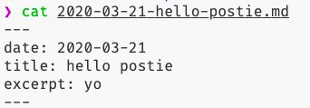

# Postie

A handy tool to create metadata for your markdown blog posts.


## Why the name

It sounds cute.

## Usage

`postie config`: Open the configuration file

`postie -p [PATH]`: Specify the output path

`postie -t [TEMPLATE]`: Generate file with a specific template. You need to make sure the template is already in your config file. See how to create a template below.

## Create Template

`postie new template`

### Format of the template file

Postie asks questions with the help of [ Inquirer.js ](https://github.com/sboudrias/inquirer.js/). And the template for your metadata is generated from your questions. For example, based on `questions` below, Postie will prompt you to fill in `title` and `excerpt`.

```javascript
const questions = [
  {
    name: "title",
    type: "input",
    message: "title: "
  },
  {
    name: "excerpt",
    type: "input",
    message: "excerpt: "
  }
];
```




After you run `postie new template`, Postie will open the editor, and you should create a question array following the format above. Note that the default type is `input`, so if you write

```javascript
[
  {
    name: "title"
  }
];
```

Postie will generate

```
---
date: {{date}}
title: {{title}}
---
```

For all possible prompt types, please see [doc for Inquirer.js](https://github.com/SBoudrias/Inquirer.js/#prompt-types).
